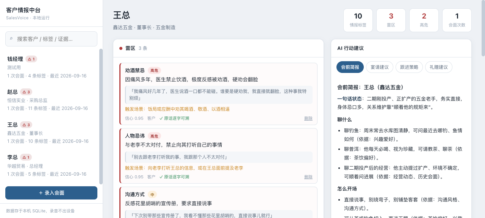

# SalesVoice · 客户语音情报中台

[](https://github.com/nikiki-star/salesvoice/actions/workflows/ci.yml)


[更新日志](CHANGELOG.md) · [最新版本](https://github.com/nikiki-star/salesvoice/releases/latest)

**把销售和客户的对话，变成可累积的客户情报——喜好、兴趣、雷区，以及下次见面该怎么做。**

不是又一个会议纪要工具。市面上的转录工具都在回答「这次谈了什么」，
SalesVoice 回答的是「**这个客户是什么样的人，我下次该怎么应对，什么话绝对不能说**」。



---

## 为什么做这个

开源生态里有两类成熟工具，但都差一步：

- **会议纪要工具**（Meetily、Whisper 系 UI）——转录 + 摘要 + 行动项，
  服务的是团队内部会议，没有「客户」这个概念，且只做单次会议；
- **开源 CRM**（twenty、krayin、espocrm）——有客户档案，但没有语音入口，
  更不会从对话里抽取「客户讨厌什么」。

**没有人做的那一层**，就是本项目：

| 空白 | 说明 |
|---|---|
| **负向情报** | 现有工具都在总结「谈了什么」，没人做「客户明确厌恶什么」——而这恰恰是避雷的核心 |
| **跨会面累积** | 现有方案全是单次会议；这里是客户级画像，情报随每次见面迭代 |
| **社交场景建议** | 会前简报、宴请点菜、话题黑名单——从情报直接到行动 |
| **中文商务语境** | 酒桌文化、人情往来、称呼禁忌，西方工具的结构里没有这些概念 |

---

## 核心能力

| 能力 | 说明 |
|---|---|
| 🎙 **本机语音转写** | SenseVoice（中文/粤语），音频不出设备；实测 CPU 上 **5.8× 实时**，无需 GPU、无需 torch |
| 👥 **说话人区分** | 支持 `【客户】/【销售】` 标记，**只有客户说的话**才会被记为客户情报 |
| 🏷 **六类标签抽取** | 事实 / 偏好 / **雷区** / 风格 / 关系 / 商务 |
| 🔍 **证据回验（防幻觉）** | 每条标签强制附原文引用并回掷校验，分 `exact` / `fuzzy` / 未通过三档 |
| 📈 **跨会面累积** | 新情报自动取代旧情报，历史版本保留可查 |
| 🧠 **AI 行动建议** | 会前简报 / 宴请建议 / 跟进策略 / 礼赠建议，每条都标注依据标签 |
| ⚠️ **雷区预检** | “我打算带两瓶茅台过去” → 判定是否踩雷并给出改法 |
| 🔎 **跨客户检索** | “谁提过白酒”这类全局问题 |
| 🖥 **单文件看板** | 零构建、零 CDN 依赖，纯本地运行 |

---

## 快速开始

```bash
git clone https://github.com/nikiki-star/salesvoice.git
cd salesvoice

# 1) 建环境（需要 Python 3.10+；用 uv 最快）
uv venv --python 3.11 .venv
uv pip install --python .venv/bin/python -r requirements.txt

# 2) 下载本机语音识别模型（约 240MB，仅首次，来自 sherpa-onnx 官方 release）
PYTHONPATH=src .venv/bin/python -m salesvoice.setup_models

# 3) 配置 LLM 凭据（任何 OpenAI 兼容端点；用 DeepSeek 就填它的 key）
export SALESVOICE_LLM_API_KEY=sk-xxxx
#   或写进环境变量文件，或让它自动读取 ~/.hermes/.env 中的 DEEPSEEK_API_KEY

# 4) 启动看板
PYTHONPATH=src .venv/bin/python -m salesvoice.server 8777
#   浏览器打开 http://127.0.0.1:8777
```

**最快体验路径**：打开看板 → 点「＋ 录入会面」→ 把 `tests/sample_transcript.txt`
的内容粘进去 → 立刻看到标签和雷区。

### 命令行用法

```bash
# 音频直接入库（本机转写 → 抽取 → 中台）
PYTHONPATH=src .venv/bin/python -m salesvoice.cli ingest --audio 录音.m4a --client 王总

# 用已有转录文本（更快，不消耗转写时间）
PYTHONPATH=src .venv/bin/python -m salesvoice.cli ingest --text 对话.txt --client 王总

# 看画像（--evidence 会显示每条标签的客户原话）
PYTHONPATH=src .venv/bin/python -m salesvoice.cli show 王总 --evidence

# 生成宴请建议
PYTHONPATH=src .venv/bin/python -m salesvoice.cli advice 王总 --type banquet

# 雷区预检：这个安排会不会踩雷？
PYTHONPATH=src .venv/bin/python -m salesvoice.cli check 王总 "带两瓶茅台过去，聊他儿子接班"

# 跨客户检索
PYTHONPATH=src .venv/bin/python -m salesvoice.cli search 白酒
```

### 想让客户对话完全不出本机？

把 LLM 也换成本地模型（需先装 [Ollama](https://ollama.com)）：

```bash
export SALESVOICE_LLM_BASE_URL=http://127.0.0.1:11434/v1
export SALESVOICE_LLM_MODEL=qwen2.5:14b
```

---

## 工作原理

```
录音文件 ──▶ ① 转写层 transcribe.py
             SenseVoice 本机离线（或云端引擎 / 直接粘贴文稿）
             + 说话人标记【客户】【销售】
                    │
                    ▼
             ② 抽取层 extract.py
             LLM 结构化抽取 → 六类标签
             + 证据回验（evidence grounding）
                    │
                    ▼
             ③ 中台层 store.py
             SQLite：客户 / 会面 / 标签
             跨会面累积，新情报取代旧情报
                    │
                    ▼
             ④ 建议层 suggest.py
             会前简报 / 宴请建议 / 跟进策略 / 礼赠建议
             + 雷区预检
                    │
                    ▼
             ⑤ 展示层 web/index.html
             单文件看板：画像卡 / 标签云 / 时间线 / 建议 / 预检
```

### 证据回验：这个项目最核心的机制

销售情报最怕 AI 编造。「客户不吃辣」必须能一键回溯到客户的原话，
所以每条标签都要经过回掷原文的校验：

| 档位 | 含义 | 处理 |
|---|---|---|
| `exact` | 逐字命中原文 | 保留原置信度 |
| `fuzzy` | 近似命中（语音识别有错字，如「不吃辣」识别成「不吃啦」） | 置信度 ×0.92，界面标「≈ 近似可溯」 |
| 未通过 | 对不上原文 | 置信度 ×0.5，界面标红「⚠ 待复核」 |

模糊回退用的是**全部匹配块总长占比**而非最长单块——错字夹在证据中间时，
最长单块会断成两截导致误判。这个细节有单测覆盖（11 例，含 3 个「应当拒绝编造」的负例）。

```bash
PYTHONPATH=src .venv/bin/python tests/test_evidence.py   # 11/11 通过
```

---

## 标签体系

```
fact        事实   行业/公司/职位/籍贯/代际/家庭/教育/健康
preference  偏好   饮食口味/酒类茶烟/兴趣/运动/收藏/旅行/品牌/常聊话题
landmine    雷区   ⚠ 话题禁忌/人物忌讳/饮食禁忌/健康禁忌/宗教政治/行为禁忌/称呼禁忌
                   —— 带 严重度(high/medium/low) 和 触发场景
style       风格   直爽 or 含蓄 / 数据导向 or 关系导向 / 快节奏 or 慢热 / 决策方式
relation    关系   关系阶段/信任度/关键联系人/跟进节奏/人情往来偏好
business    商务   需求痛点/预算/决策链/竞品态度/时间节点/顾虑异议
```

真实抽取示例（来自本机 ASR 转写的对话）：

```
✓ exact  [landmine  ] 劝酒禁忌  因痛风多年医生禁酒，极度反感被劝酒，硬劝会翻脸  [high]
         触发场景：饭局或应酬中劝酒、敬酒、以酒相逼时
         原话：「我痛风好几年了，医生说酒一口都不能碰。谁要是硬劝我，我直接就翻脸」
✓ exact  [landmine  ] 人物忌讳  与老李不对付，禁止向其打听自己的事  [high]
≈ 近似   [preference] 饮食口味  不吃辣，偏好清淡，最好是粤菜
```

---

## 抽取引擎：两个可选

用 `--extract-engine` 切换（HTTP 接口传 `extract_engine`）。

| 引擎 | 说明 |
|---|---|
| `default`（默认） | 自研。LLM 输出结构化标签 + 中文子串回验 |
| `langextract` | 由 [google/langextract](https://github.com/google/langextract) 驱动，靠其 `char_interval` 对齐溯源 |

**实测对比（同一份材料，两个引擎各跑一次）：**

| 指标 | 自研 | langextract |
|---|---|---|
| 短对话 89 字：标签数 / 可溯率 | 5 / **100%** | 7 / **100%** |
| 完整转录 544 字：标签数 / 可溯率 | 10 / **100%** | 11 / **73%** |

短文本两者打平且 langextract 粒度更细；但**文本一长，它的中文对齐明显退化**
（544 字时 3 条标签无法锚定回原文）。销售场景最不能接受「无法回溯」，
所以默认引擎是自研，langextract 作为**交叉验证的第二意见**——
两个引擎都抽到且都能溯源的标签，可信度最高。

复现对比：

```bash
PYTHONPATH=src .venv/bin/python tests/compare_engines.py
```

---

## 复用的开源底座

本项目的立足点是在成熟开源库之上拼装，而不是从零造轮子：

| 项目 | Star | 许可证 | 用途 |
|---|---|---|---|
| [QwenAudio/SenseVoice](https://github.com/QwenAudio/SenseVoice) | 9.3k | MIT | 中文 ASR 模型本体；非自回归，CPU 友好，自带情感与音频事件 |
| [k2-fsa/sherpa-onnx](https://github.com/k2-fsa/sherpa-onnx) | — | Apache-2.0 | 本机推理运行时，**纯 ONNX 无需 torch**，Intel Mac 也能跑 |
| [snakers4/silero-vad](https://github.com/snakers4/silero-vad) | — | MIT | 长音频自动分段 |
| [google/langextract](https://github.com/google/langextract) | 38.6k | Apache-2.0 | 可选抽取引擎；也是默认引擎证据回验机制的思想来源 |
| [modelscope/FunASR](https://github.com/modelscope/FunASR) | 20.4k | MIT | SenseVoice 的训练/推理框架生态 |

> 也调研过 [Zackriya-Solutions/meetily](https://github.com/Zackriya-Solutions/meetily)（30.8k★，MIT）——
> 最接近的整机方案，但它的输出是**会议纪要模板**，社区版**没有说话人分离**
> （锁在商业 Pro 版），且只做单次会议。这三点正是本项目重做语义层的理由。

---

## ⚠️ 合规提醒

客户对话录音在中国属于**敏感个人信息**，《个人信息保护法》要求取得**单独同意**。

- 录音前明确告知并取得对方同意（建议保留告知过程的记录）；
- 涉及第三方的信息（「他不喜欢某某人」）风险更高，建议只在本地留存；
- 看板支持**一键删除**任意情报条目（用于移除不准确或敏感内容）；
- 默认设计是**音频不出本机**（SenseVoice 本地推理），但**标签抽取默认调用云端 LLM**；
  需要全程离线时，把 `SALESVOICE_LLM_BASE_URL` 指向本机 Ollama。

**本项目是一个技术工具，合规责任在使用者。**

---

## 项目结构

```
salesvoice/
├── src/salesvoice/
│   ├── config.py              配置与凭据（只从环境/环境变量文件读，不落盘）
│   ├── schema.py              ★ 标签体系与抽取规范
│   ├── transcribe.py          语音转写（可插拔：本机/云端/文稿）
│   ├── extract.py             ★ 情报抽取 + 证据回验
│   ├── langextract_engine.py  可选引擎：google/langextract 驱动
│   ├── store.py               ★ SQLite 中台，跨会面累积
│   ├── suggest.py             AI 建议 + 雷区预检
│   ├── server.py              HTTP 后端（仅标准库，零额外依赖）
│   ├── cli.py                 命令行入口
│   └── setup_models.py        模型下载
├── web/index.html             ★ 单文件看板（零构建、零 CDN）
├── tests/
│   ├── conftest.py            pytest 收集配置（排除需模型/凭据的验收脚本）
│   ├── test_evidence.py       证据回验单测（11 例，零第三方依赖）
│   ├── test_server_smoke.py   后端冒烟：真起 server 打 HTTP（8 项断言）
│   ├── e2e_test.py            端到端 API 全链路（人工验收，需凭据）
│   ├── test_asr.py            本机 ASR 验证（人工验收，需模型）
│   ├── compare_engines.py     双引擎对比
│   └── sample_transcript.txt  示例对话
├── .github/workflows/ci.yml   CI：证据回验 + pytest + Linux 安装与后端冒烟
├── CHANGELOG.md               更新日志
├── docs/                      截图等资产
├── models/                    模型权重（不入库，setup_models 下载）
└── data/                      SQLite / 转录 / 录音（不入库）
```

---

## 路线图

已完成的部分直接可用，以下是可以继续做的方向：

- [ ] **说话人分离自动化** —— 当前依赖转录文稿里的 `【客户】` 标记，
      接入 pyannote 或 FunASR 的 cam++ 可自动分离（需 HuggingFace token）
- [ ] **实时录音转写** —— 目前是「录完导入」
- [ ] **看板拖拽上传音频** —— 目前是填文件路径
- [ ] **标签人工修正闭环** —— 现支持删除，可加编辑与合并
- [ ] **向量检索** —— 现为 SQL LIKE，可加 embedding 做语义检索
- [ ] **多用户 / 权限** —— 当前是单人本地工具

---

## 测试

测试分两层，**能在 CI 里跑的必须零外部条件**（不需要模型权重、不需要 LLM 凭据、不花钱）。

```bash
# ---- 第一层：CI 上跑（提交即自动执行，见 .github/workflows/ci.yml）----
PYTHONPATH=src .venv/bin/python tests/test_evidence.py     # 证据回验 11 例，零第三方依赖
PYTHONPATH=src .venv/bin/python tests/test_server_smoke.py # 真起 server 打 HTTP，8 项断言
.venv/bin/python -m pytest -q                              # 上两项（需 pip install pytest）

# ---- 第二层：人工验收（需额外条件，不在 CI 里）----
PYTHONPATH=src .venv/bin/python tests/test_asr.py          # 本机转写（需先下 240MB 模型）
PYTHONPATH=src .venv/bin/python -m salesvoice.server 8777 & \
  .venv/bin/python tests/e2e_test.py                       # 端到端全链路（需 LLM 凭据，会真实调用模型）
PYTHONPATH=src .venv/bin/python tests/compare_engines.py   # 双引擎抽取对比（需 LLM 凭据）
```

需要模型或凭据的脚本由 `tests/conftest.py` 显式排除，pytest 不会在收集阶段就把它们跑起来
（`e2e_test.py` 在 import 时就会断言失败，`test_asr.py` 没有模型会中断整轮收集）。

CI 在 Python **3.10 / 3.11 / 3.12** 上跑第一层，另有一个 job 校验
`requirements.txt` 在 Linux 上能装、全部模块可导入、`server` 能起来并正确响应。

---

## License

[MIT](LICENSE) —— 可商用、可修改、可闭源分发。

第三方组件许可详见 [LICENSE](LICENSE) 末尾。本项目不分发模型权重，
模型由使用者在首次运行时自行下载。
